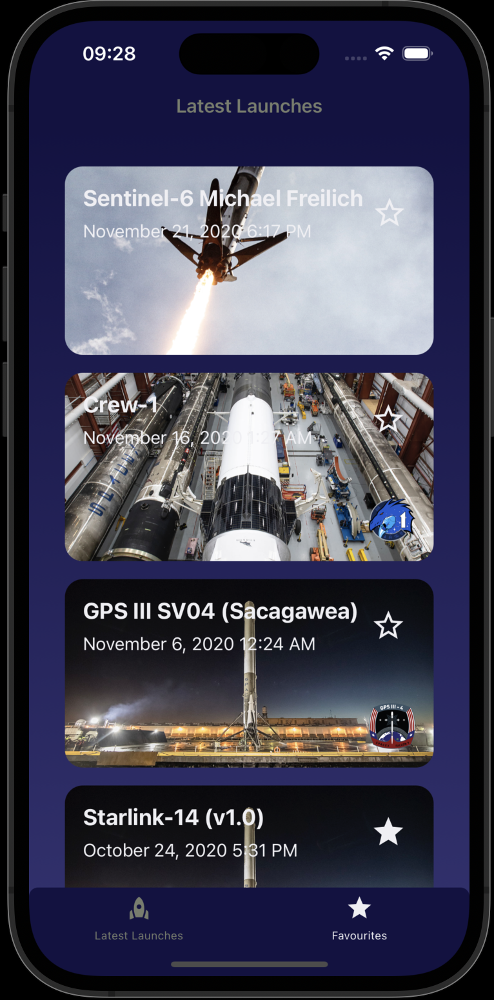

[TYPESCRIPT__BADGE]: https://img.shields.io/badge/typescript-D4FAFF?style=for-the-badge&logo=typescript
[REACT__NATIVE__BADGE]: https://img.shields.io/badge/react-native?style=for-the-badge&logo=react&logoColor=005CFE&label=React%20Native
[EXPO__BADGE]: https://img.shields.io/badge/expo-router?style=for-the-badge&logo=expo

<h1 align="center" style="font-weight: bold;">Skyward 🚀</h1>

![react_native][REACT__NATIVE__BADGE]
![expo][EXPO__BADGE]
![typescript][TYPESCRIPT__BADGE]

<p align="center">
  <a href="#about">About</a> • 
  <a href="#started">Getting Started</a> • 
  <a href="#unit">Running Unit tests</a> • 
  <a href="#endtoend">Running End to End Tests</a>
</p>

<p align="center">
    
</p>

<h2 id="started">📱 About</h2>

Skyward is a mobile app that lists latest SpaceX launches. It's built on top of ReactNative/Expo using expo-router and Redux Toolkit.

<h2 id="started">🚀 Getting started</h2>

Since Skyward is an Expo app, you'll need your React Native / Expo environment ready

<h3>Requirements</h3>

- XCode with commandlinetools
- AndroidStudio
- [Node.js LTS release](https://nodejs.org/en/) - Only Node.js LTS releases (even-numbered) are recommended.
- [Git](https://git-scm.com/)
- [Watchman](https://facebook.github.io/watchman/docs/install#buildinstall)

<h3>Running the app</h3>

Clone this repository:

```bash
git clone https://github.com/danlaurent/skyward.git
```

Install dependencies and start expo

```bash
cd skyward
yarn install
yarn start
```

<h2 id="unit">✅ Running Unit Tests</h2>

Too run unit tests and collect code coverage, run the following command:

```bash
yarn testFinal
```

<h2 id="endtoend">🤖 Running E2E Tests</h2>

Ensure you have [Detox](https://wix.github.io/Detox/) environment setup.

Run the following commands:

```bash
yarn detox:build
yarn detox:test
```

<h3>Documentations that might help</h3>

[📝 Expo](https://docs.expo.dev/)

[💾 React Native](https://reactnative.dev/docs/getting-started)
